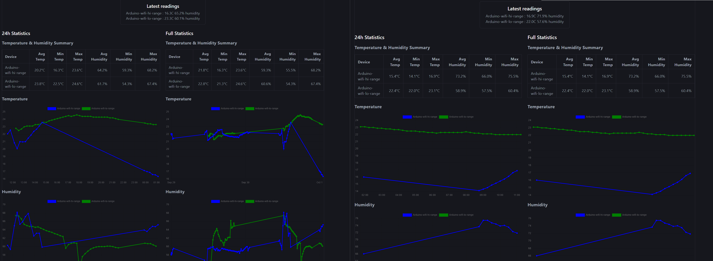
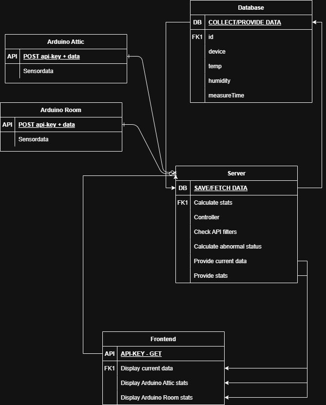
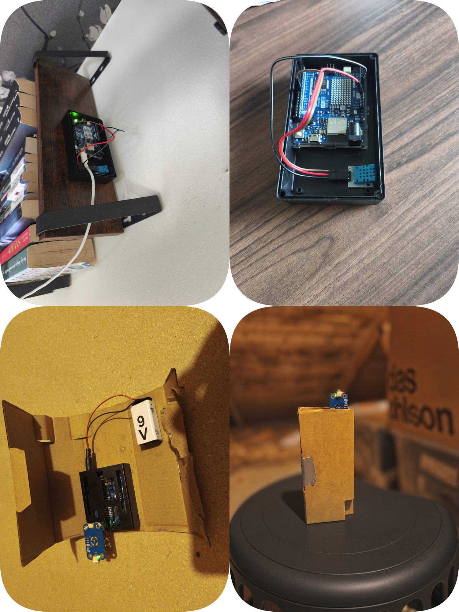

# Home Sense
This is for a IoT school assignment.

IoT temperature/humidity monitoring. Arduino UNO R4 WiFi sensors post readings
to a Spring Boot + MongoDB backend; a React frontend displays live data and
historical stats.  
<a href="resources/stats.png"></a>
## Architecture

- `arduino/` — sensor firmware, posts JSON over HTTP
- `backend-spring/` — Spring Boot API + MongoDB
- `frontend-react/` — React/Vite dashboard (charts + current readings)
- MongoDB — stores raw measurements


<a href="./resources/Data-flow.png"></a>  

## Setup
### Set up the hardware. 
My hardware consists of 2 Arduino Uno Rev Wifi. 1 DHT11 Temperature & Humidity sensor connect with 3 male-female connectors. Sensory input data at digital pin 8. 1 modulino Temperature & Humidity sensor, note that this sensor has a wider range and is more precise.
#### Here's how my setup looks:
<a href="resources/Arduinos-in-use.png"></a>  
1. Copy `.env.example` to `.env` and fill in:
   - `ARDUINO_API_KEY`
   - `FRONTEND_API_KEY`
2. For each Arduino setup, Copy `settings.h.example` to `settings.h` and fill in WiFi + API key.
3. Install Arduino IDE [Arduino](https://www.arduino.cc/en/software/)
4. Install `ArduinoHttpClient`, `ArduinoJson` and `DHT sensor library`(by Adafruit) or `Arduino_Modulino` (depending on what sensor you have) through the library manager.
5. Verify the code, and upload the corresponding code to your sensor.

### How to run with Docker
-  To run the project, create a .env file in the root. There is a .env.example file to show the variables you need to set.
-  Run Docker. (Install [Docker](https://www.docker.com/).)
-  First time running, from the root of the project, run.
  ```
  docker compose up --build
  ```
- Subsequent times, build is unneccessary.
```
 docker compose up
```
  
- Navigate to [Localhost](http://localhost:5173/)

### How to run without Docker
- To run the project, create a .env file in the ./frontend-react/ and ./backend-spring/ folders. There is a .env.example file to show the variables you need to set.
- Backend:
  ```
  cd ./backend-spring
  mvn spring-boot:run || Run with your IDE
  ```
- Frontend:
```
cd ./frontend-react
npm install
npm run dev
```
- Navigate to [Localhost](http://localhost:5173/)

## Known Issues
Some endpoints are not implemented.  
Exception handling is quite minimal. There's some validation of saved data, out of range data is caught on the backend and discarded. Endpoints don't give any feedback on this however.


## API

- `POST /arduino/sensor-data` — Arduino sensor ingestion, requires `API-Key` header
- `GET /frontend/...` — Dashboard data endpoints, requires a separate `API-Key` header
- `GET /frontend/live-data` - Fetches the latest readings from each sensor.
- `GET /frontend/24stats` - Fetches all readings from the last 24 hours sorted by device and time.
- `GET /frontend/all-stats` - Fetches all readings in the database and sorts them by device from oldest to newest.
#### Unimplemented API
- `GET /frontend/status` - The idea is to provide exceptions if readings point to any problems. Including mold risk or erratic sensors.
- `DELETE /frontend/delete-all` - If you want to clear the database.
- `DELETE /frontend/delete` - If you want to clear readings from a specific time-span.

## Security notes

- API key auth via `ApiKeyAuthFilter`, checked per-path (`/arduino`, `/frontend`)
- Secrets live in `.env` / `settings.h`

## Tech Stack

### Firmware

- Arduino UNO R4 WiFi (WiFiS3)
- ArduinoJson, ArduinoHttpClient
- DHT11 (Adafruit DHT sensor library) / Modulino thermo-humidity sensor

### Backend

- Java 21, Spring Boot 4
- Spring Data MongoDB, Spring Security (API key filter), Spring Validation
- Maven

### Frontend

- React + TypeScript (Vite)
- Chart.js / react-chartjs-2 + chartjs-adapter-date-fns
- Axios

### Database
- MongoDB

## Personal reflections
##### 
I have chosen to use Spring Boot with MongoDB database management because this project had many different components to it, and I am most familiar with this API framework.
#####
React was chosen because I wanted to display my current data with live updates without reloading the dashboard. This was however quite unnecessary with how the project currently works, sensor updates only arrive every 15 minutes and most user will not notice the live data. 
#####
The choice of sensors was a lucky guess, Before this project started, I did not know that the sensors were different. It did work out well though because the DHT11 is not designed to measure temperatures below 0C°, and the modulino sensor is able to measure a much wider range. This works well with what I wanted my product to do.
